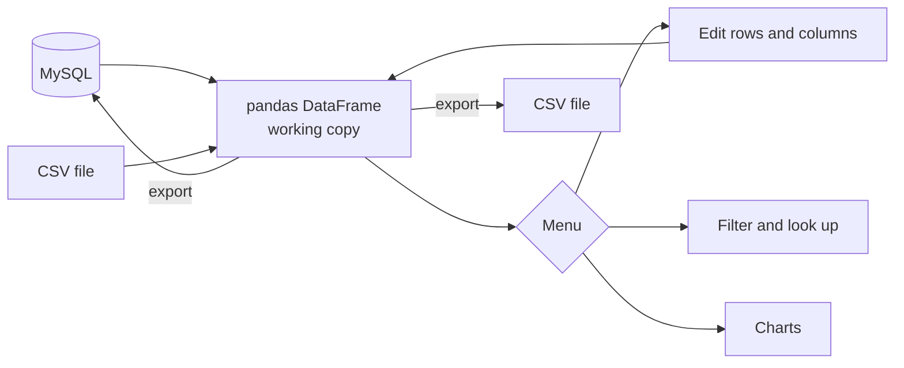

# Automobile Management System

A command-line tool for keeping a car dealership's records in order: the vehicles on the lot and the customers buying them. Load the data from MySQL or a CSV file, edit it, ask it questions, chart it, and write it back.

I built this in Grade 12 for my Informatics Practices project. It's where I first got hooked on data work: loading a messy table, asking it something specific ("which automatic cars under 25k are still available?") and getting an answer back in a second.

```text
9. Retrieve Specific Data
Enter column name to filter by: FuelType
Enter value to filter FuelType by: Electric
Filtered Data:
+-------------+--------+---------+--------+---------+-----------+-----------+------------+----------------+
|   VehicleID | Make   | Model   |   Year |   Price | Status    |   Mileage | FuelType   | Transmission   |
+=============+========+=========+========+=========+===========+===========+============+================+
|          11 | Tesla  | Model 3 |   2022 |   45000 | Available |      3000 | Electric   | Automatic      |
+-------------+--------+---------+--------+---------+-----------+-----------+------------+----------------+
```

## Features

Two modules, **Vehicle inventory** and **Customer details**, each with the same toolkit:

| Action | What it does |
|---|---|
| Load | From a MySQL table or a CSV file |
| Edit rows | Add, update, change a single value, delete |
| Edit columns | Add, overwrite, delete, rename |
| Filter | Any pandas expression, e.g. `Price < 25000 and Status == "Available"` |
| Look up | Exact match on one column |
| Chart | Bar, histogram or line chart of any column (matplotlib) |
| Describe | Row and column counts, shape, data types, first rows |
| Export | Back to MySQL, or to a new CSV file |

## How it works



Everything happens on an in-memory DataFrame. Nothing touches the database or the files until you choose an export, so you can experiment freely and throw the changes away by exiting.

## Run it

Requires Python 3.9 or later.

```bash
python -m venv .venv && source .venv/bin/activate
pip install -r requirements.txt
python pyboardproject.py
```

Choose **Vehicle inventory**, then **CSV file**, and it runs with the sample data in `vehicles.csv`. No database needed.

To use MySQL instead, create the database and sample data, then point the app at it:

```bash
mysql -u root -p < ipboardprojectsql_code.sql
export MYSQL_URL="mysql+pymysql://<user>:<password>@localhost:3306/NEW_AUTOMOBILE_MANAGEMENT"
python pyboardproject.py
```

## Data model

| Table | Columns |
|---|---|
| `VEHICLES` | `VehicleID` (PK, auto-increment), `Make`, `Model`, `Year`, `Price` (DECIMAL 10,2), `Status`, `Mileage`, `FuelType`, `Transmission` |
| `CUSTOMERS` | `CustomerID` (PK, auto-increment), `FirstName`, `LastName`, `Email` (unique), `Address` |

## Project layout

| File | What's in it |
|---|---|
| `pyboardproject.py` | The whole app: menus, the two modules and every action |
| `ipboardprojectsql_code.sql` | Creates the database and tables, with sample vehicles and customers |
| `vehicles.csv` | Sample vehicle data for CSV mode |
| `customers.csv` | Placeholder for customer data (empty) |
| `requirements.txt` | Python dependencies |

## What I'd do differently now

Looking back at this a few years on, a few things stand out:

- **One module, not two.** The vehicle and customer modules are near copies. Today I'd write a single table editor and pass it the table name.
- **Exporting replaces the table.** `to_sql(if_exists="replace")` drops and recreates the MySQL table, which quietly loses the primary key, the auto-increment and the unique email constraint. Upserting changed rows would keep the schema intact.
- **The customer CSV is empty,** and its expected headers (`Name`, `Phone`) don't match the SQL table (`FirstName`, `LastName`), so customers currently need MySQL.
- **Filters run `DataFrame.eval` on typed input.** That's fine for a local tool you run yourself, but it's not something to expose to other people.
- **Tests.** There aren't any. A few for the filter and export paths would have caught the two issues above.

## Built with

Python, pandas, MySQL, SQLAlchemy with PyMySQL, matplotlib and tabulate.
