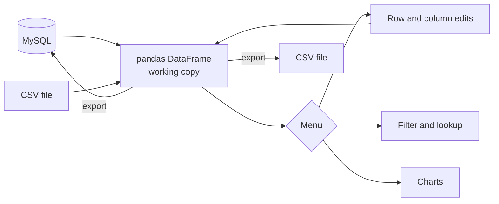

# Automobile Management System

A command-line records system for a car dealership, built on pandas and MySQL.


## Overview

The application manages two datasets, vehicle inventory and customer records. Data is loaded from MySQL or CSV into a pandas DataFrame, edited and queried through an interactive menu, visualised with matplotlib, and exported back to either store.

It was developed as the Grade 12 Informatics Practices project.

## Contents

- [Features](#features)
- [Architecture](#architecture)
- [Data model](#data-model)
- [Getting started](#getting-started)
- [Usage](#usage)
- [Project structure](#project-structure)
- [Known limitations](#known-limitations)

## Features

Both modules, **Vehicle inventory** and **Customer details**, provide the same operations:

| Operation | Description |
|---|---|
| Load | Read a MySQL table (SQLAlchemy with PyMySQL) or a CSV file |
| Row editing | Insert, update a row, update a single value, delete |
| Column editing | Add, overwrite, delete, rename |
| Query | Filter with pandas expressions, e.g. `Price < 25000 and Status == "Available"` |
| Lookup | Exact match on a single column |
| Visualisation | Bar chart, histogram or line chart of any column |
| Inspection | Row and column counts, shape, data types, first rows |
| Export | Write to MySQL or to a new CSV file |

## Architecture



All operations act on an in-memory DataFrame. The source data is unchanged until an export is requested, so a session can be discarded by exiting.

## Data model

| Table | Columns |
|---|---|
| `VEHICLES` | `VehicleID` INT (PK, auto-increment), `Make`, `Model`, `Year`, `Price` DECIMAL(10,2), `Status`, `Mileage`, `FuelType`, `Transmission` |
| `CUSTOMERS` | `CustomerID` INT (PK, auto-increment), `FirstName`, `LastName`, `Email` (unique), `Address` |

The schema and sample data are defined in [`ipboardprojectsql_code.sql`](ipboardprojectsql_code.sql).

## Getting started

### Prerequisites

- Python 3.9 or later
- MySQL 8 (optional; CSV mode needs no database)

### Installation

```bash
python -m venv .venv
source .venv/bin/activate
pip install -r requirements.txt
```

### Configuration

To use MySQL, create the database and sample data, then set the connection string:

```bash
mysql -u root -p < ipboardprojectsql_code.sql
export MYSQL_URL="mysql+pymysql://<user>:<password>@localhost:3306/NEW_AUTOMOBILE_MANAGEMENT"
```

If `MYSQL_URL` is unset, the application connects as `root` without a password on `localhost`.

## Usage

```bash
python pyboardproject.py
```

Select **Vehicle inventory**, then **CSV file**, to run against the bundled sample data. Example lookup:

```text
Enter column name to filter by: FuelType
Enter value to filter FuelType by: Electric
Filtered Data:
+-------------+--------+---------+--------+---------+-----------+-----------+------------+----------------+
|   VehicleID | Make   | Model   |   Year |   Price | Status    |   Mileage | FuelType   | Transmission   |
+=============+========+=========+========+=========+===========+===========+============+================+
|          11 | Tesla  | Model 3 |   2022 |   45000 | Available |      3000 | Electric   | Automatic      |
+-------------+--------+---------+--------+---------+-----------+-----------+------------+----------------+
```

## Project structure

| File | Description |
|---|---|
| `pyboardproject.py` | Application entry point: menus, both modules and all operations |
| `ipboardprojectsql_code.sql` | Database and table definitions with sample data |
| `vehicles.csv` | Sample vehicle data for CSV mode |
| `customers.csv` | Placeholder for customer data (currently empty) |
| `requirements.txt` | Python dependencies |

## Known limitations

- **Duplicated modules.** The vehicle and customer modules share near-identical code; a single table-agnostic editor would remove the duplication.
- **Export replaces the table.** `DataFrame.to_sql(if_exists="replace")` drops and recreates the MySQL table, discarding the primary key, auto-increment and unique constraint. Upserting modified rows would preserve the schema.
- **Customer CSV.** `customers.csv` is empty and its expected headers (`Name`, `Phone`) differ from the SQL schema (`FirstName`, `LastName`), so the customer module currently requires MySQL.
- **Expression filters.** Filters are evaluated with `DataFrame.eval` on user input, which is appropriate only for local, single-user use.
- **No automated tests.** Tests for the filter and export paths would cover the two data-integrity issues above.
